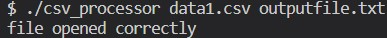
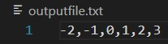

# CSV File Processing Program

This program reads an input CSV file, calculates the average of the numbers, and then creates an output CSV file with each number replaced by its difference from the average.

## Program Overview

The program uses command-line arguments to specify input and output file names and follows these key concepts:

### 1. Command-Line Arguments

The program takes two command-line arguments:
- The input CSV file name.
- The output CSV file name.

### 2. File Input and Output

The program reads integers from the input CSV file and stores them in a vector. It then calculates the average of the numbers and replaces each number in the vector with its difference from the average. Finally, it writes the modified numbers to an output txt file.

### 3. Error Handling

The program verifies that the input file was opened correctly and outputs an error message if it cannot be opened. It also checks if the output file was opened or created correctly and reports an error if it cannot be opened.

## Usage

To compile and run the program:

>	g++ main.cpp -o csv_processor

>	./csv_processor data1.csv outputfile.txt

## Output Sample
CLI output:

File output:

