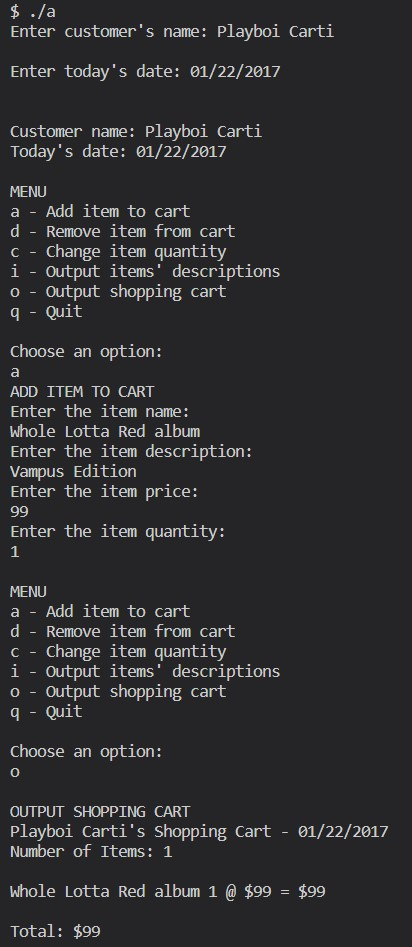

# Shopping Cart Program

## Description
This program implements a simple shopping cart system that allows a user to interactively add, remove, and modify items in their shopping cart. The program provides a menu-driven interface for the user to perform various operations on their shopping cart.

## Features
- **Add Item to Cart (Option 'a')**: Users can add items to their shopping cart by providing the item's name, description, price, and quantity.

- **Remove Item from Cart (Option 'd')**: Users can remove items from their shopping cart by specifying the item's name.

- **Change Item Quantity (Option 'c')**: Users can change the quantity of an item in their shopping cart by specifying the item's name and the new quantity.

- **Output Items' Descriptions (Option 'i')**: Users can view the descriptions of all the items in their shopping cart.

- **Output Shopping Cart (Option 'o')**: Users can view the total cost of the items in their shopping cart.

- **Quit (Option 'q')**: Users can exit the program.

## Usage
1. Run the program by compiling it with the following command:

>   g++ main.cpp ItemToPurchase.cpp ShoppingCart.cpp -Wall -Wuninitialized -o ./a.exe


2. Execute the compiled program:

>   ./a.exe


3. Follow the on-screen prompts to interact with the shopping cart.

## Input
- Customer's name
- Today's date
- Menu options ('a', 'd', 'c', 'i', 'o', 'q') for adding, removing, changing, viewing descriptions, viewing the shopping cart, or quitting.
- Item information including name, description, price, and quantity.

## Output
- Customer's name and today's date
- Updates on the status of the shopping cart based on the chosen menu options.
- Item descriptions and total cost of items in the shopping cart.

## Note
- The program uses three C++ source files: `main.cpp`, `ItemToPurchase.cpp`, and `ShoppingCart.cpp`.

## Example
```plaintext
Enter customer's name: John Doe

Enter today's date: 2023-09-22

Customer name: John Doe
Today's date: 2023-09-22

MENU
a - Add item to cart
d - Remove item from cart
c - Change item quantity
i - Output items' descriptions
o - Output shopping cart
q - Quit

Choose an option: a

ADD ITEM TO CART
Enter the item name:
Widget A
Enter the item description:
A high-quality widget
Enter the item price:
15
Enter the item quantity:
2

MENU
a - Add item to cart
d - Remove item from cart
c - Change item quantity
i - Output items' descriptions
o - Output shopping cart
q - Quit

Choose an option: i

OUTPUT ITEMS' DESCRIPTIONS
Item descriptions:
1. Widget A: A high-quality widget
Quantity: 2

MENU
a - Add item to cart
d - Remove item from cart
c - Change item quantity
i - Output items' descriptions
o - Output shopping cart
q - Quit

Choose an option: o

OUTPUT SHOPPING CART
Total cost: $30

MENU
a - Add item to cart
d - Remove item from cart
c - Change item quantity
i - Output items' descriptions
o - Output shopping cart
q - Quit

Choose an option: q
```

## Output Sample
