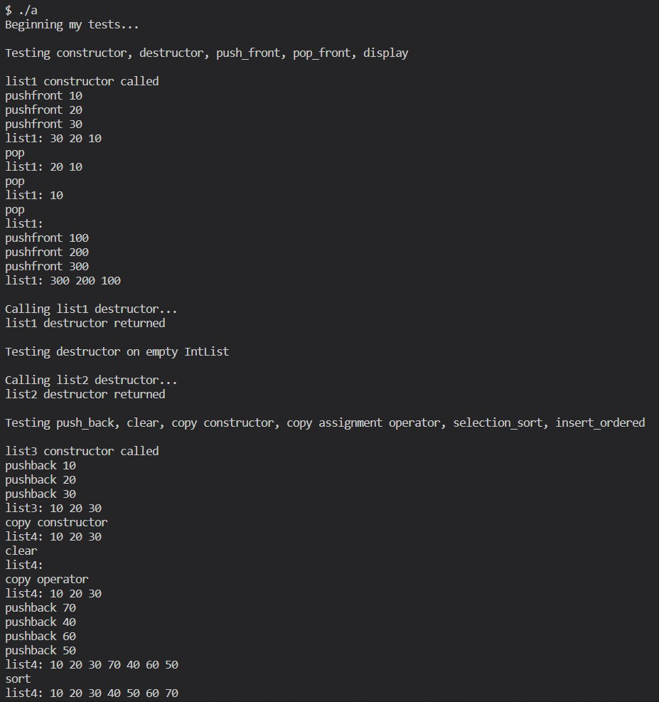

# C++ Object-Oriented Programming

This repository contains all of the C++ programs pertaining to the **Object-Oriented Programming** series, developed during my undergraduate studies. Each folder contains a `README.md` that briefly overviews the concept that was studied, whereas each subfolder contains either a lab or a PROGRAM that includes a `README.md` with documentation and descriptions that demonstrate these principles in action.

## List of PROGRAMS:
1. [Wind Tunnel Data Interpolator Tool](3.%20Classes%20I%20%2B%20PROGRAM%201/PROGRAM%201%20files)
2. [Calendar Dates Program](4.%20Classes%20II%20%2B%20PROGRAM%202/PROGRAM%202%20files)
3. [Shopping Cart Program](5.%20Arrays%20%2B%20PROGRAM%203/PROGRAM%203%20files)
4. [Vector Implementation and Testing](6.%20Pointers%20%2B%20PROGRAM%204/PROGRAM%204%20files)
5. [Linked List Implementation and Testing](7.%20Linked%20Lists%20%2B%20PROGRAM%205/PROGRAM%205%20files)
6. [Set Implementation and Testing](9a.%20Searching%20%26%20Sorting%20%2B%20PROGRAM%206/PROGRAM%206%20files)

## List of labs:
1. **[In-class Example Practice](1.%20ICE%20Practice)**
2. **[Streams](2.%20Streams)** 
    - [File Summation](2.%20Streams/Lab%202.1%20files)
    - [Character Count](2.%20Streams)
    - [CSV File Processing](2.%20Streams\Lab%202.3%20files)
3. **[Classes I](3.%20Classes%20I%20%2B%20PROGRAM%201)**
    - [Rational Number Calculator](3.%20Classes%20I%20%2B%20PROGRAM%201\Lab%203.12%20files)
4. **[Classes II](4.%20Classes%20II%20%2B%20PROGRAM%202)**
    - [Distance Calculator](4.%20Classes%20II%20%2B%20PROGRAM%202\Lab%204.13%20files)
5. **[Arrays](5.%20Arrays%20%2B%20PROGRAM%203)**
    - [Array Manipulation](5.%20Arrays%20%2B%20PROGRAM%203\Lab%205.12%20files)
6. **[Pointers](6.%20Pointers%20%2B%20PROGRAM%204)**
    - [Vector Implementation](6.%20Pointers%20%2B%20PROGRAM%204\Lab%206.8%20files)
7. **[Linked Lists](7.%20Linked%20Lists%20%2B%20PROGRAM%205)**
    - [Linked List Implementation](7.%20Linked%20Lists%20%2B%20PROGRAM%205\Lab%207.10%20files)
8. **[Inheritance & Polymorphism](8.%20Inheritance%20%26%20Polymorphism)**
    - [Fantasy Battle Simulator](8.%20Inheritance%20%26%20Polymorphism\Lab%208.11%20files)
9. **[Recursion](9.%20Recursion)**
    - [String Reversal Program](9.%20Recursion\Lab%209.10%20files)
    - [Minimum Element Finder](9.%20Recursion\Lab%209.11%20files)
    - [Vector Recursion](9.%20Recursion\Lab%209.12%20files)
10. **[Searching & Sorting](9a.%20Searching%20%26%20Sorting%20%2B%20PROGRAM%206)**
    - [Recursive File Copying](9a.%20Searching%20%26%20Sorting%20%2B%20PROGRAM%206\Lab%2010.9%20files)

### PROGRAM 5 Sample:

